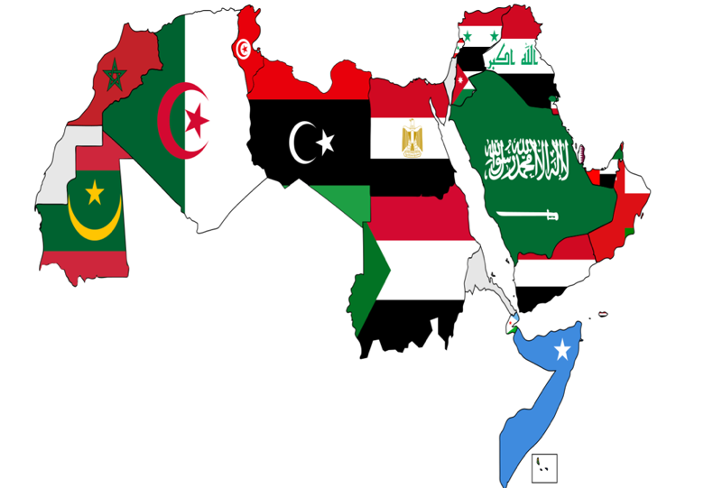

**[العراق]{dir="rtl"}**

[الخرِيطة الثامِنة]{dir="rtl"} Map 8

{width="6.495833333333334in"
height="3.298611111111111in"}

{width="2.548611111111111in"
height="2.832586395450569in"}**[المحتويات]{dir="rtl"}**

[المفردات (]{dir="rtl"}Vocabulary[)]{dir="rtl"}

[الموقع]{dir="rtl"} (Location)

[البنية الاجتماعية]{dir="rtl"} [(]{dir="rtl"}Social
structure[)]{dir="rtl"}

[السياسة ونظام الحكم]{dir="rtl"} (Regime Political System)

[الاقتِصاد]{dir="rtl"} (Economy)

[التاريخ]{dir="rtl"} (History)

[التراكيب]{dir="rtl"} [اللغوية]{dir="rtl"} (Grammatical Structure)

[النّسبة والنَّسَب]{dir="rtl"} (The Nisba Adjective) []{dir="rtl"}

[أنواع اللام / لــ]{dir="rtl"} (The Meaning &Function of)

[المَبني للمجهول]{dir="rtl"} (Passive Voice)

[المناقشة وأسئلة الاستيعاب]{dir="rtl"} (Discussion & Comprehensive
Questions)

[الثقافة]{dir="rtl"} (Culture)

[مشروع]{dir="rtl"} [وتقديم]{dir="rtl"} (Project & Presentation)

[المناقشة وأسئلة الاستيعاب]{dir="rtl"} (Discussion & Comprehensive
Questions)

{width="1.0729166666666667in"
height="0.8763888888888889in"}

<h3>اختبار المعلومات Software Quiz</h3>

اختر الإجابة الصحيحة من القائمة المنسدلة لكل سؤال.

<ol>
    <li>
        
{width="3.5368055555555555in" height="2.629861111111111in"} هذا هو العلَم

        <label for="q1">الإجابة:</label>
        <select id="q1" name="q1">
            <option selected>اختر الإجابة</option>
            <option>اليمني</option>
            <option>العراقي</option>
            <option>السعوديي</option>
            <option>البحريني</option>
        </select>
    </li>
    <li>
        
يَقعُ هذا البلد ________ الجزيرة العربيَّة.

        <label for="q2">الإجابة:</label>
        <select id="q2" name="q2">
            <option selected>اختر الإجابة</option>
            <option>جنوب</option>
            <option>شمال</option>
            <option>غرب</option>
            <option>شرق</option>
        </select>
    </li>
    <li>
        
عاصِمة هذا البلد هي ________

        <label for="q3">الإجابة:</label>
        <select id="q3" name="q3">
            <option selected>اختر الإجابة</option>
            <option>صنعاء</option>
            <option>بغداد</option>
            <option>عمّان</option>
            <option>بيروت</option>
        </select>
    </li>
    <li>
        
يَتكلّمُ سُكّان هذا البلد اللغة ________

        <label for="q4">الإجابة:</label>
        <select id="q4" name="q4">
            <option selected>اختر الإجابة</option>
            <option>الصينيّة</option>
            <option>العربيَّة</option>
            <option>الألمانيّة</option>
            <option>الإنجليزيَّة</option>
        </select>
    </li>
    <li>
        
هذا البلد ________

        <label for="q5">الإجابة:</label>
        <select id="q5" name="q5">
            <option selected>اختر الإجابة</option>
            <option>تركي</option>
            <option>عربي</option>
            <option>ايراني</option>
            <option>أميركي</option>
        </select>
    </li>
</ol>

    
مفتاح الإجابات

    <ol>
        <li>العراقي</li>
        <li>شمال</li>
        <li>بغداد</li>
        <li>العربيَّة</li>
        <li>عربي</li>
    </ol>

**[المفردات]{dir="rtl"}** **(Vocabulary)**

[احْتَلَّ، يَحْتلّ، احتِلال (هو مُحْتَلّ، المفعول: مُحْتَلّ)]{dir="rtl"} to occupy:

[اخْتَرَعَ، يَختَرِع، اخْتِراع (هو مُخترِع، المفعول: مُخْتَرَع)]{dir="rtl"} to invent:

[أدَب، آداب (ج)]{dir="rtl"}literature; etiquette:

[أذَّنَ ]{dir="rtl"})[بـ، لـ]{dir="rtl"}([، يُؤَذِّن، أذان (هو
مُؤَذِّن)]{dir="rtl"} call for prayer:

[مِئْذَنَة]{dir="rtl"} [^2][، مِئْذَنَات/ مَآذِن (ج)]{dir="rtl"} [:]{dir="rtl"}
minaret

[ارْتبَطَ ]{dir="rtl"})[بـ]{dir="rtl"} [،]{dir="rtl"}
[في]{dir="rtl"}([، يَرْتَبِط، ارتِباط (هو مُرتبِط،
والمفعول: مُرتبَط بهِ)]{dir="rtl"} to be connected; bod; engaged:

[أسْلُوب، أسَالِيْب (ج)]{dir="rtl"}style:

[آشُور، آشُوْرِي]{dir="rtl"}Assyrian:

[أَصِيل، أصَالة]{dir="rtl"}authentic; genuine :(noun)

[أعْطَى، يُعْطِيْ، إعْطَاء/ عَطَاء (هو مُعْطٍ / المُعْطِيْ، المفعولُ: مُعْطًى
إليهِ)]{dir="rtl"} to give:

[اعتقدَ بـ، يَعْتقِد، اعتقاد (هو مُعْتَقِد، المفعول: مُعْتَقَد)]{dir="rtl"} be hold
the view that; believe:

[ عَقِيدَة، عقائِد (ج)]{dir="rtl"}religions belief:

[اكْتَشَفَ يَكْتَشِف، اكْتِشَاف (هو مُكْتَشِف، المفعول: مُكْتَشَف)]{dir="rtl"} to discover:

[الْتَقى (بـ)، يَلتَقي، التِقاء (هو مُلْتَقٍ/المُلتقي، المفعول: مُلْتَقًى)]{dir="rtl"}
to meet with; get together:

[أنْتجَ، يُنْتِج، إنتاج (هو مُنتِج، المفعول مُنتَج عنه)ِ]{dir="rtl"}to produce;
bring about:

[ نتَجَ (عن)، يَنتِج، نَتَاج (هو ناتِج، المفعول: مَنْتَج)]{dir="rtl"} to emanate
from; be result of:

[اِنتَدبَ، يَنتدِب، انْتِداب (هو مُنتَدِب، المفعول: مُنتَدَب عنه)]{dir="rtl"} to
assign; mandate (n):

[انْتَمَى (إلى)، يَنْتَمِي، انْتِمَاء (هو مُنْتَمٍ/ المُنْتَمِي،
المفعول: مُنْتَمًى إليهِ)]{dir="rtl"} to be a member of, descended from:
[]{dir="rtl"}

[انْتَهَى (من)، يَنْتَهِي، انْتِهَاء (هو مُنْتَهٍ/ المُنتَهِي)،
المفعول: مُنتهًى منه)]{dir="rtl"} to finish:

[بَقيَّة، بَقايا (ج)]{dir="rtl"}remain; rest:
[]{dir="rtl"}\][بقِيَ ]{dir="rtl"})[في)، يَبْقَى، بَقَاء]{dir="rtl"}\[to
remain:

[بُرْج، أبْرَاج (ج)]{dir="rtl"}tower:

[تَبادَلَ يتَبادَل، تبادُل (هو مُتبادِل، المفعول مُتبادَل معه)]{dir="rtl"} to
exchange:

[تماماً]{dir="rtl"}\] perfectly: [تمَّ، يَتِمّ، تَمام (هو تامّ)]{dir="rtl"} \[to
be completed:

[تَمْرَة، تَمْر (ج)]{dir="rtl"} :[بَلَح]{dir="rtl"} date;

[تَكَفَّلَ بـ، يَتَكَفَّل، تَكَفُّل (هو مُتَكَفِّل، المفعول: مُتَكَفَّل به) ]{dir="rtl"}to
obligate oneself; pledge:

[ثَرِي، أثْرِيَاء (ج): غنيّ، أغْنِياء]{dir="rtl"} [(ج)؛]{dir="rtl"} rich;
wealthy

[حَدِيقة، حَدائِق (ج)]{dir="rtl"} park; garden:

[حِقْبَة، حِقِب/ حِقْبات (ج) :مُدّة طويلة]{dir="rtl"} ; [زَمن]{dir="rtl"} long
period; era; time; []{dir="rtl"}

[دَوَّنَ، يُدَوِّن، تَدْوِيْن (هو مُدَوِّن، المفعول: مُدَوَّن)]{dir="rtl"} take a record:

[رَقدَ، يَرْقُد، رقود/رَقْد (هو راقِد)]{dir="rtl"} to rest; lay to rest:

[مَرقَد، مَراقِد (ج)]{dir="rtl"} shrine:

[ركَّبَ، يُركِّب، تركِيب (هو مُركِّب، المفعول مُركَّب) :]{dir="rtl"}to assemble;
install

[تَرْكِيبة، تَرْكِيبات/تَراكِيب (ج):]{dir="rtl"} structure

[سعَى (إلى، في، لـ)، يَسعَى، سَعٍ/السَّعي (هو ساعٍ، المفعول: مَسْعِيّ إليهِ)
:]{dir="rtl"} seek after; strive for

[سَيْطَرَ على، يُسْيطِر، سَيْطَرة (هو مُسَيْطِر، المفعول: مُسَيْطَر عليهِ) :]{dir="rtl"}
rule over; control; dominate

[شَأن، شُؤون (ج)]{dir="rtl"} matter; affair:

[شكّلَ، يُشكِّل، تشكيل (هو مُشكِّل، المفعول مُشكَّل منه)]{dir="rtl"}:
[كوّنَ]{dir="rtl"} to form; shape; make up;

[ضِفّة، ضِفَاف/ ضَفَّات (ج)]{dir="rtl"}bank of river:

[ضَمَّ، يَضُمّ، ضَمّ (هو ضَامّ، المفعول: مَضْمُوم)]{dir="rtl"} :[اِحتوى]{dir="rtl"} to
include; contain;

[طَائِفَة، طَوَائِف (ج)]{dir="rtl"}sector:

[عاشَ، يَعِيش، عَيْش/عِيشَة/ مَعِيشَة]{dir="rtl"} to live:

[عَجِبَ، يَعجب، عجَب (هو عَجِيب)]{dir="rtl"} to wonder or marvel at:

[عَجيبة، عجائِب (ج)]{dir="rtl"}wonders:

[فَنّ، فُنون (ج)]{dir="rtl"} artistic production:

[قرَّرَ، يقرِّر، تقرِير (هو مقرِّر، المفعول مقرَّر)]{dir="rtl"} to resolve;
decide:

[كَثَّفَ يُكَثِّفَ، كَثافَة (هو كثِيف)]{dir="rtl"} be dense:

[كَثافَة، كثافات (ج)]{dir="rtl"}density:

[كِلْدَان، كِلْدَانيّ :]{dir="rtl"} Chaldean

[لَوَى، يَلْوِي، لَيّ/ لَوْي (هو لاوٍ/اللاوِي، المفعول: مَلْوٍ/المَلوي)]{dir="rtl"} to
twist:

[مَلْوِيَة:]{dir="rtl"} a spiral ramp

[مَارَسَ، يُمَارِس، مُمَارَسَة (هو مُمَارِس، المفعول: مُمَارَس)]{dir="rtl"} to practice:

[مُدّة، مُدد (ج) :]{dir="rtl"} [فترة]{dir="rtl"}; [زمن]{dir="rtl"}
duration; period; time; []{dir="rtl"}

[مَذْهَب، مَذَاهِب (ج)]{dir="rtl"}doctrine:

[مَرْكَز، مَراكِز (ج)]{dir="rtl"} center:

[مَزَجَ، يَمْزُجُ، مَزْج (هو مَازِج، المفعول: مَمْزُوْج)]{dir="rtl"} to mix; blend:

[مَزِيْج]{dir="rtl"} mixture; combination:

[مَلْحَمَة، مَلْحَمَات/ مَلاحِم (ج)]{dir="rtl"} epic

[نَخْلَة، نَخِيْل (ج)]{dir="rtl"}date palm:

[نَزَحَ (من، إلى)، يَنْزَح، نُزُوْح (هو نَازِح)]{dir="rtl"} [:]{dir="rtl"} to leave
home land

[نظَرَ (إلى، في، لـ)، يَنظُر، نَظَر (هو ناظِر، المفعول: مَنْظور)]{dir="rtl"}to
look at, eyesight:

[نَهْر، أنْهَار (ج)]{dir="rtl"}river:

[هَرَم، أهرام/ أهرَامات (ج)]{dir="rtl"} pyramid:

[ورِثَ، يرِث، وِرْث /إِرْث /وِراثة (هو وارِث /ورِيث، المفعول: مَوْروث)]{dir="rtl"}
to inherit:

[إِرْث]{dir="rtl"} legacy; heritage:

**[تعبيرات]{dir="rtl"} Expression**

[بِرُغْمِ أنَّ]{dir="rtl"}despite the fact that, though:

[لا سِيَّما: بخاصّة]{dir="rtl"} particularly; [^3]

[فضْلاً عن: بالإضَافة إلى؛]{dir="rtl"} in addition to

[كمَا هَو شَأْنُ:]{dir="rtl"} as is the case

**[المصطلحات المدنية والاقتصادية والسياسية]{dir="rtl"} Civil, Economic
and Political Terms:**

[بِلاد مَا بَيْنَ النّهْرَيْن (دِجْلَةُ والْفُرَات)]{dir="rtl"} [:]{dir="rtl"}
Mesopotamia

[خِلافَة عَبَّاسِيَّة]{dir="rtl"}Abbasi Dynasty:

[كِتَابَة مَسْمَارِيَّة]{dir="rtl"} Cuneiform writing: []{dir="rtl"}

[وادِي الرَّافِدَيْن (رَافِد: نَهْر):]{dir="rtl"} Mesopotamia

[مَسَلَّة حَمُوْرَابِي:]{dir="rtl"} Code of Hammurabi

[**أوّلاً: الموقع**/]{dir="rtl"} **Location**

[الاسم الرسميّ: جُمْهُوريَّة العِرَاق]{dir="rtl"}

[العراق بلد عربيّ يقع في الشَّرق الأوسط، ويطلّ على الخليج العربيّ. عاصمته
بغداد، وتحدّه الكوَيت والمملكة العربيَّة السعوديَّة من الجنوب،
وتركيَّا]{dir="rtl"} [مِنَ الشَّمال، وسُوريا]{dir="rtl"} [والأُردن من الغرب،
وإيران من الشَّرق. يطلّ العراق على الخليج العربيّ بساحل قدره 60 كم في محافظة
البصرة حيث تقع موانئ العراق التجارية. ويعدّ العراق جزءاً من الصحراء
العربيَّة وبادية الشام، ويَمرّ فيه نهرا دجلة والفرات. ويتكوَّن العراق رسمياً من
ثمان عشرة محافظة.]{dir="rtl"}

<section class="quiz-block" dir="rtl" lang="ar">
<h3>اختبار سريع Quiz</h3>

<strong>اخْتر الإجابة الصحيحة: ضع علامة في المربّع الصحيح.</strong>

<ol class="digital-quiz">
<li>

<strong>أينَ يقع العراق في الخريطة؟</strong>

<label><input type="checkbox" name="q1" value="1"> في القسم الشمالي الشرقي من الوطن العربيّ</label>
<label><input type="checkbox" name="q1" value="2"> في القسم الجنوبي الغربي من قارة آسيا</label>
<label><input type="checkbox" name="q1" value="3"> على الخليج العربي</label>
<label><input type="checkbox" name="q1" value="4"> كل الإجابات صائِبة</label>
</li>
<li>

<strong>تطلّ مدينةُ البصرة على ________</strong>

<label><input type="checkbox" name="q2" value="1"> الخليج العربيّ</label>
<label><input type="checkbox" name="q2" value="2"> المملكة السعودية</label>
<label><input type="checkbox" name="q2" value="3"> البحر الأحمر</label>
<label><input type="checkbox" name="q2" value="4"> الصحراء العربيَّة</label>
</li>
<li>

<strong>يتكوّن العراق رسمياً من كم محافظة؟</strong>

<label><input type="checkbox" name="q3" value="1"> 60 مُحافظة</label>
<label><input type="checkbox" name="q3" value="2"> 18 مُحافظة</label>
<label><input type="checkbox" name="q3" value="3"> 8 مُحافظات</label>
<label><input type="checkbox" name="q3" value="4"> 28 مُحافظة</label>
</li>
<li>

<strong>تقع موانئ العراق التجارية في أي محافظة؟</strong>

<label><input type="checkbox" name="q4" value="1"> بغداد</label>
<label><input type="checkbox" name="q4" value="2"> البصرة</label>
<label><input type="checkbox" name="q4" value="3"> الكويت</label>
<label><input type="checkbox" name="q4" value="4"> الفرات</label>
</li>
<li>

<strong>_______ نهرا دجلة والفرات في العراق.</strong>

<label><input type="checkbox" name="q5" value="1"> يعدّ</label>
<label><input type="checkbox" name="q5" value="2"> يطلّ</label>
<label><input type="checkbox" name="q5" value="3"> يمرّ</label>
<label><input type="checkbox" name="q5" value="4"> يحدّ</label>
</li>
</ol>

مفتاح الإجابات

<ol>
<li>في القسم الجنوبي الغربي من قارة آسيا</li>
<li>الخليج العربيّ</li>
<li>18 مُحافظة</li>
<li>البصرة</li>
<li>يمرّ</li>
</ol>

</section>

[**ثانياً: البنية الاجتماعية**/]{dir="rtl"} **Social Structure**

[**السكَّان** (]{dir="rtl"}**Population**[)]{dir="rtl"}

[بلغ عدد سكَّان جمهوريَّة العراق نحو]{dir="rtl"} 42 [مليون نسْمة بحسب آخر
تقرير رسميّ للعام]{dir="rtl"} 022[2. إذ يمثّل العرب نِسبة 75%]{dir="rtl"}.
[يمثّل الأكراد نِسبة 15% منهم، والتركمان نحو 2.3% بالمئة. في حين تمثل
الأقلّيات الأخرى -- الأرمن والكلدان والاشوريين- النسبة الباقية من سكَّان
العراق. ويرجع أصل سكّان العراق للقبائل العربية التي نزحت من الجزيرة
العربية في الألف السادس قبل الميلاد.]{dir="rtl"}

[**اللغةُ**]{dir="rtl"} **Language)**[)]{dir="rtl"}

[تُعدّ اللغة العربيَّة من اللّغات الأكثر انتشاراً في العراقِ، إذ يتحدّث نحو 20 ٪
من السكّان اللغة الكرديّة. وهناكَ نِسبة قليلة من السكّان تتحدّث لغات أخرى مثل
اللغة التركمانيَّة (الآذرية الجنوبية) والآشورية والآرامية. وتُعدّ اللغتان
العربيَّة والكُرديّة اللغتينِ الرسميتين في العراق بحسب دستور عام 2005. ويذكر
الدستور العراقيّ أنَّ اللغتين التركمانيَّة والسريانية لغتان رسميتان أيضا في
الوحدات الإدارية التي يمثلون فيها كثافة سكانية. وتعدّ اللغة الإنجليزيَّة من
أهمّ اللّغات الأجنبيّة التي تدرس في المدارس والجامعات العراقيّة، فضلاً عن
اللّغات الفرنسيّة، والإسبانيّة، والألمانية، والروسيّة، والعبريّة،
وغيرها.]{dir="rtl"}

**[الديانة]{dir="rtl"}** [(]{dir="rtl"}**Religion**[)]{dir="rtl"}

[العراق فيه تركيبة سكانية متعدّدة الأعراق والأديان والطوائِف. ويعدّ الإسلام
دين الدولة الرسميّ، وهو مصدر أساسيّ للتشريع. إذ يمثّل المسلمون نسبة 95% من
سكَّان العراق. ويمثّل أتباع الديانات الأخرى كالمسيحيين، واليزيديين،
والصابئة المندائيين والديانات الأخرى أقلَّ بالنسبة إلى المسلمين، فتشكّل
الأقليات 5% من نسبة السكّان. وأعطى الدستور العراقيّ الحريّة لأتباع كلّ مذهب
ودين حرية ممارسة شعائرهم الدينيَّة، وتتكّفل الدولة حرية العبادة وحماية
أماكنها]{dir="rtl"}.

**[اختبار سريع]{dir="rtl"} [(]{dir="rtl"}Software Quiz[)]{dir="rtl"}**

<section class="quiz-block" dir="rtl" lang="ar">
<h3>اختبار سريع Quiz</h3>

<strong>اخْتر الإجابة الصحيحة بوضع علامة في المربّع.</strong>

<ol class="digital-quiz">
<li>

<strong>أيّ العبارات صائبة كما جاءت في النّص؟</strong>

<label><input type="checkbox" name="soc1" value="1"> معظم سكّان العراق ليسوا مُسلمين</label>
<label><input type="checkbox" name="soc1" value="2"> العراق دولة مسلمة</label>
<label><input type="checkbox" name="soc1" value="3"> معظم سكان العراق مسيحيون ويهود</label>
<label><input type="checkbox" name="soc1" value="4"> اليهوديّة هي ديانة الأكثريّة في العراق</label>
</li>
<li>

<strong>يتكلّم أغلبية العراقيين:</strong>

<label><input type="checkbox" name="soc2" value="1"> اللغة التركمانيَّة</label>
<label><input type="checkbox" name="soc2" value="2"> اللغة السريانيةَ</label>
<label><input type="checkbox" name="soc2" value="3"> اللغة الكُردِيّة</label>
<label><input type="checkbox" name="soc2" value="4"> اللغة العربيَّة</label>
</li>
<li>

<strong>تمثّل الديانات المسيحيَّة واليزيديَّة والصابئة المندائيَّة:</strong>

<label><input type="checkbox" name="soc3" value="1"> ديانات الأقليات في العراق</label>
<label><input type="checkbox" name="soc3" value="2"> نسبة خمس وتسعين بالمئة من سكَّان العراق</label>
<label><input type="checkbox" name="soc3" value="3"> نسبة خمس بالمئة من السكّان</label>
<label><input type="checkbox" name="soc3" value="4"> نسبة عشرين بالمئة مِنَ السكّان</label>
</li>
<li>

<strong>تعود أصول أغلبية سكّان العراق إلى:</strong>

<label><input type="checkbox" name="soc4" value="1"> القبائل الكُردية النازِحة من شمال الوطن العربي</label>
<label><input type="checkbox" name="soc4" value="2"> القبائل الآشورية والآرامية التي حكمت العراق بعد الميلاد</label>
<label><input type="checkbox" name="soc4" value="3"> القبائل العربية النازِحة من الجزيرة العربية</label>
<label><input type="checkbox" name="soc4" value="4"> القبائل السريانية التي عاشت في الجزيرة العربية</label>
</li>
<li>

<strong>الدستور يقوم على:</strong>

<label><input type="checkbox" name="soc5" value="1"> الشريعة الإسلامية واليزيدية</label>
<label><input type="checkbox" name="soc5" value="2"> حرية الأديان</label>
<label><input type="checkbox" name="soc5" value="3"> الطائفية</label>
<label><input type="checkbox" name="soc5" value="4"> كل الإجابات صائبة</label>
</li>
</ol>

مفتاح الإجابات

1. العراق دولة مسلمة

2. اللغة العربيَّة

3. ديانات الأقليات في العراق

4. القبائل العربية النازِحة من الجزيرة العربية

5. حرية الأديان

</section>

**[ثالثاً: السياسة ونظام الحكم]{dir="rtl"} (Regime and Political
System)**

[نظام الحكم في العراق هو نظام جمهوريّ نيابيّ (برلمانيّ) ديمقراطيّ بحسب
الدّستور العراقيّ للعام 2005. وتتكوَّن الحكومة الاتحاديَّة من السُّلطة
التَّنفيذية، والسُّلطة التشريعيَّة، والسُّلطة القضائيَّة. تُجرى انتخابات نيابية
يتمخض عنها انتخاب رئيس لمجلس النواب ورئيس للجمهورية ورئيس لمجلس الوزراء
كلَّ أربع سنوات. وفي العام 1958 نال العراق استقلال من بريطانيا، وانتهى
الحكم الملكيّ في العراق، وبدأ الحكم الجمهوريّ. وشهِد العراق في العصر الحديث
غزوا امريكيا عام 2003، وأدّى الى تغير السلطة، وثم تشكّلت حكومة عراقية
جديدة أجرت انتخابات برلمانية تعددية سنة 2005. العراق عضو مؤسّس في جامعة
الدول العربية ومنظمة المؤتمر الاسلاميّ والأمم المتحدة. ]{dir="rtl"}

**[اختبار سريع]{dir="rtl"} [(]{dir="rtl"}Software Quiz[)]{dir="rtl"}**

<section class="quiz-block" dir="rtl" lang="ar">
<h3>اختبار سريع Quiz</h3>

<strong>اخْتر الإجابة الصحيحة بوضع علامة في المربّع.</strong>

<ol class="digital-quiz">
<li>

<strong>تقوم الحكومة العراقيَّة على:</strong>

<label><input type="checkbox" name="pol1" value="1"> شريعة كلّ الأديان</label>
<label><input type="checkbox" name="pol1" value="2"> الاتَّحاد الملكي والجمهوريّ</label>
<label><input type="checkbox" name="pol1" value="3"> النظام الاتحاديّ</label>
<label><input type="checkbox" name="pol1" value="4"> كل الإجابات صائِبة</label>
</li>
<li>

<strong>نظام الحكم (برلماني) ديمقراطيّ بحسب ______ العراقي لعام 2005.</strong>

<label><input type="checkbox" name="pol2" value="1"> العضو</label>
<label><input type="checkbox" name="pol2" value="2"> الدستور</label>
<label><input type="checkbox" name="pol2" value="3"> المُمارِس</label>
<label><input type="checkbox" name="pol2" value="4"> المحكوم</label>
</li>
<li>

<strong>تُجرى الانتخابات البرلمانيّة في العراق كل:</strong>

<label><input type="checkbox" name="pol3" value="1"> 14 سنة</label>
<label><input type="checkbox" name="pol3" value="2"> 4 سنوات</label>
<label><input type="checkbox" name="pol3" value="3"> ربع سنة</label>
<label><input type="checkbox" name="pol3" value="4"> أربعين سنة</label>
</li>
<li>

<strong>نال العراق ______ من بريطانيا عام 1958.</strong>

<label><input type="checkbox" name="pol4" value="1"> استخدامه</label>
<label><input type="checkbox" name="pol4" value="2"> استقلاله</label>
<label><input type="checkbox" name="pol4" value="3"> تأسيسه</label>
<label><input type="checkbox" name="pol4" value="4"> تَكفُّله</label>
</li>
<li>

<strong>بدأ الحكم الجمهوريّ في العراق:</strong>

<label><input type="checkbox" name="pol5" value="1"> بعد الاحتلال العثمانيّ</label>
<label><input type="checkbox" name="pol5" value="2"> بعد انتهاء الاحتلال الامريكيّ</label>
<label><input type="checkbox" name="pol5" value="3"> بعد انتهاء الحكم الملكيّ</label>
<label><input type="checkbox" name="pol5" value="4"> بعد الاحتلال البريطانيّ</label>
</li>
</ol>

مفتاح الإجابات

1. النظام الاتحاديّ

2. الدستور

3. 4 سنوات

4. استقلاله

5. بعد انتهاء الحكم الملكيّ

</section>

**[رابعاً: الاقتِصاد (]{dir="rtl"}Economy[) ]{dir="rtl"}**

[يعتمد الاقتصاد العراقيّ على الثروة النفطية والغاز الطبيعيّ وقليل من
الثروة السمكيّة والزراعيّة وصناعة التعدين مثل الفوسفات، والملح، والكبريت،
والصناعات الحرفيَّةِ، والسياحة. ويمتلك العراق خامس أكبر احتياطيّ نفطيّ في
العالم. إذ تمثّل واردات قطاع النفط 95% من إجمالي دَخل العراق. ويُعدّ العراق
من أقدم مواطن زراعة النخيل في العالم ومن المصدّرين للتمور، إذ كان أوّل
ظهور لنخيل التمر في العالم القديم في مدينة أريدو]{dir="rtl"} [التاريخية
الواقعة جنوبي العراق (نحو 4000 ق.م)، ويحتلّ العراق المرتبة الخامسة عالمياً
في إنتاج التمور.]{dir="rtl"}

[السّياحة: تساهم السّياحة التاريخيَّة والدينيَّة بنسبة ضئيلة من الناتج القوميّ
العراقيّ بالرغم من أنّ العراق غنيّ بالإرث الحضاري والتاريخي والطبيعي. ومن
أهمّ الآثار التاريخيَّة في العراق برج بابل، وبوابة عشتار، ومدينة الحضر،
والزقّورة، وقلعة شيروانة بالسليمانية وغيرها. وفي العراق -أيضاً- العديد من
المَتاحف التاريخَّية والطبيعية، مثل المتحف العراقيّ، ومتحف التاريخ الطبيعيّ
ببغداد. ويضمّ العراق أهمّ المقدّسات الدينية عند المذهب الشيعي ولا سيّما في
النجف وكربلاء، فضلاً عن مراقد الأنبياء، مثل آدم ونوح وهود وصالح (عليهم
السلام).]{dir="rtl"}

[ويُعدّ الدينار العراقيّ العُملة المحلية المعتمدة.]{dir="rtl"}

<section class="quiz-block" dir="rtl" lang="ar">
<h3>اختبار سريع Quiz</h3>

<strong>اخْتر الإجابة الصحيحة بوضع علامة في المربّع.</strong>

<ol class="digital-quiz">
<li>

<strong>يمثل قطاع النفط:</strong>

<label><input type="checkbox" name="eco1" value="1"> خمس وتسعين بالمئة من إجمالي دَخل العراق</label>
<label><input type="checkbox" name="eco1" value="2"> خمس بالمئة من إجمالي دَخل العراق</label>
<label><input type="checkbox" name="eco1" value="3"> عشرة بالمئة من إجمالي دَخل العراق</label>
<label><input type="checkbox" name="eco1" value="4"> لم يبقَ أي نفط في العراق بعد عام 2003</label>
</li>
<li>

<strong>يُعدّ العراق من أقدم مواطن زراعة النخيل في العالم ومن المصدرين للتمر.</strong>

<label><input type="checkbox" name="eco2" value="1"> صناعة</label>
<label><input type="checkbox" name="eco2" value="2"> زراعة</label>
<label><input type="checkbox" name="eco2" value="3"> سياحة</label>
<label><input type="checkbox" name="eco2" value="4"> حريَّة</label>
</li>
<li>

<strong>في العراق العديدِ من ______ التاريخيَّة والطبيعية.</strong>

<label><input type="checkbox" name="eco3" value="1"> الحكومات</label>
<label><input type="checkbox" name="eco3" value="2"> المَتاحف</label>
<label><input type="checkbox" name="eco3" value="3"> السّلطات</label>
<label><input type="checkbox" name="eco3" value="4"> الدساتِير</label>
</li>
<li>

<strong>العراق يضمّ كثيراً من المقدسات عند المذهب الشّيعي ولا سيما في النجف وكربلاء.</strong>

<label><input type="checkbox" name="eco4" value="1"> يسهِم</label>
<label><input type="checkbox" name="eco4" value="2"> يضمّ</label>
<label><input type="checkbox" name="eco4" value="3"> يتَّحِد</label>
<label><input type="checkbox" name="eco4" value="4"> يسعى</label>
</li>
<li>

<strong>تساهم السّياحة التاريخيَّة والدينيَّة بنسبة ضئيلة من الناتج القوميّ العراقيّ.</strong>

<label><input type="checkbox" name="eco5" value="1"> عُملة</label>
<label><input type="checkbox" name="eco5" value="2"> قلعة</label>
<label><input type="checkbox" name="eco5" value="3"> ثروة</label>
<label><input type="checkbox" name="eco5" value="4"> نسبة</label>
</li>
</ol>

مفتاح الإجابات

1. خمس وتسعين بالمئة من إجمالي دَخل العراق

2. زراعة

3. المَتاحف

4. يضمّ

5. نسبة

</section>

{width="2.5965277777777778in"
height="1.7847222222222223in"}[**خامساً؛ التاريخ**
(]{dir="rtl"}**History**[)]{dir="rtl"}

<section class="quiz-block" dir="rtl" lang="ar">
<h3>اختبار سريع Quiz</h3>

<strong>اخْتر الإجابة الصحيحة بوضع علامة في المربّع.</strong>

<ol class="digital-quiz">
<li>

<strong>كانت أرض العراق تُعرف باسم:</strong>

<label><input type="checkbox" name="hist1" value="1"> سرّ مَن رأى</label>
<label><input type="checkbox" name="hist1" value="2"> مَدينة السّلام</label>
<label><input type="checkbox" name="hist1" value="3"> وادي الرافدين</label>
<label><input type="checkbox" name="hist1" value="4"> الجزيرة العربيّة</label>
</li>
<li>

<strong>اشتُهرت مدينة أور السومريّة بـ:</strong>

<label><input type="checkbox" name="hist2" value="1"> أسد بابل</label>
<label><input type="checkbox" name="hist2" value="2"> الحدائق المعلقة</label>
<label><input type="checkbox" name="hist2" value="3"> الزقورات</label>
<label><input type="checkbox" name="hist2" value="4"> باب عشتار</label>
</li>
<li>

<strong>ما اسم المخطط الذي يوضح العاصمة العراقية؟</strong>

<label><input type="checkbox" name="hist3" value="1"> بوابة عشتار</label>
<label><input type="checkbox" name="hist3" value="2"> مخطط العاصمة بغداد</label>
<label><input type="checkbox" name="hist3" value="3"> المئذنة الملوية</label>
<label><input type="checkbox" name="hist3" value="4"> مدينة الحضر</label>
</li>
<li>

<strong>ما اسم المئذنة المشهورة في سامراء؟</strong>

<label><input type="checkbox" name="hist4" value="1"> بوابة عشتار</label>
<label><input type="checkbox" name="hist4" value="2"> مخطط العاصمة بغداد</label>
<label><input type="checkbox" name="hist4" value="3"> المئذنة الملوية</label>
<label><input type="checkbox" name="hist4" value="4"> مدينة الحضر</label>
</li>
<li>

<strong>صارت مدينة سامراء عاصمة الخلافة العباسيَّة الجديدة على يد:</strong>

<label><input type="checkbox" name="hist5" value="1"> الخليفة العباسيّ هارون الرشيد</label>
<label><input type="checkbox" name="hist5" value="2"> الخليفة العباسيّ المعتصم بالله</label>
<label><input type="checkbox" name="hist5" value="3"> الخليفة العباسيّ المنصور</label>
<label><input type="checkbox" name="hist5" value="4"> الملك نبوخذ نصر</label>
</li>
<li>

<strong>من أول من اخترع الكتابة المسماريَّة في العالم؟</strong>

<label><input type="checkbox" name="hist6" value="1"> العثمانيون</label>
<label><input type="checkbox" name="hist6" value="2"> السومريون</label>
<label><input type="checkbox" name="hist6" value="3"> الأكديون</label>
<label><input type="checkbox" name="hist6" value="4"> الفرس</label>
</li>
<li>

<strong>"مسلة حمورابي" هي:</strong>

<label><input type="checkbox" name="hist7" value="1"> أشهر مملكة بابلية</label>
<label><input type="checkbox" name="hist7" value="2"> أقدم قانون مُدوَّن في العالم</label>
<label><input type="checkbox" name="hist7" value="3"> أقدم وأعظم بناية أكديَّة</label>
<label><input type="checkbox" name="hist7" value="4"> أشهر حضارة إنسانيَّة</label>
</li>
</ol>

مفتاح الإجابات

1. وادي الرافدين

2. الزقورات

3. مخطط العاصمة بغداد

4. المئذنة الملوية

5. الخليفة العباسيّ المعتصم بالله

6. السومريون

7. أقدم قانون مُدوَّن في العالم

</section>

**[القواعد والتراكيب اللغوية]{dir="rtl"} Grammar and Sentence
Structure**

- [النّسبة والنَّسَب]{dir="rtl"} The Nisba Adjective

- [أنواع اللام]{dir="rtl"}/ [لــ]{dir="rtl"} The Meaning &Function of

- [المَبني للمجهول]{dir="rtl"} Passive Voice

**[المناقشة والتحليل]{dir="rtl"} Discussion &Analysis**

Analyze the underlined words in the following sentences about Map 8
[(الخريطة الثامنة)]{dir="rtl"} and use context clues to help you
understand their meanings:

Before you check the translations: first try to understand each sentence on
your own, then open the small review popup to check or correct your
intuition.

قبل أن تفتح الترجمة: حاول أن تفهم الجملة بنفسك أولاً، ثم اضغط على رمز
المراجعة لفتح الترجمة ومقارنة أو تصحيح حدسك.

1.  [[تُجْرَى]{.underline} انْتِخَابَاتٌ [مَحَلِّيَّةٌ]{.underline} لِمَنْصِبِ رَئيْسِ وُزَرَاءِ
    العِرَاقِ والبَرْلَمَان]{dir="rtl"}/ [مَجْلِسِ النُّوَّابِ كَلَّ أرْبَعِ
    سَنَوَات.]{dir="rtl"}
    

🔍 Translation

    
Local elections are held for offices (president, ministers) and the
    parliament/council of representatives every four years.

    

2.  [[كَانَتْ]{.underline} [تُعْرَفُ]{.underline} بِاسْمِ \"سُرَّ مَن رَأى\"
    [لِجَمَالِهَا]{.underline} وَطِيْبِ هَوَائِهَا.]{dir="rtl"}
    

🔍 Translation

    
It used to be known as "Surra Man Ra'a" for its beauty and pleasant
    climate.

    

3.  [[تُعَدّ]{.underline} المِئْذَنَةُ الْمُلْوَيَّةِ [لِمَسْجِدِ]{.underline} سَامَرَاءَ الّذِي
    أسَّسَهُ الْخَلِيْفَةُ المُتَوَكِّل بِاللهِ الْعَبَّاسِيّ مِن أهَمِّ المَعَالِمِ
    [الإسْلامِيَّةِ]{.underline} في مَدِيْنَةِ سَامَرّاءَ وَأقْدَمِهَا.]{dir="rtl"}
    

🔍 Translation

    
The twisted minaret of the Grand Mosque of Samarra is considered one
    of the most important Islamic monuments in the city of Samarra.

    

4.  [[كُتِبَتْ]{.underline} شَرِيْعَةُ حَمُوْرَابِي بِأسْلُوْبٍ عِلْمِيٍّ وعَمَلِيٍّ، كَمَا هَو شَأْنُ
    الْقَوَانِيْنِ الْحَدِيْثَةِ.]{dir="rtl"}
    

🔍 Translation

    
The Code of Hammurabi was written in a scholarly and practical style,
    as is the case with modern laws.

    

5.  [كَانَ أوَّلُ ظُهُوْرٍ [لَشَجَرَةِ]{.underline} نَخِيْلِ التَّمْرِ فِي الْعَالَمِ الْقَدِيْمِ فِي
    مَدِيْنَةِ أرِيْدُو.]{dir="rtl"}
    

🔍 Translation

    
The earliest appearance of the date-palm tree in the ancient world
    was in the city of Eridu.

    

**[أوّلاً؛ النّسبَة والنَّسَب]{dir="rtl"} (The Nisba Adjective)**

**Activity 1: The Nisba** **[نســبة]{dir="rtl"} Adjective (attribution)
and nouns[:]{dir="rtl"}**

a.  Underline the [نســبة]{dir="rtl"} adjective[^4] and then translate
    each sentence into English.

<!-- -->

1.  [كُتِبَتْ شَرِيْعَةُ حَمُوْرَابِي بِأسْلُوْبٍ عِلْمِيٍّ وعَمَلِيٍّ، كَمَا هَو شَأْنُ الْقَوَانِيْنِ
    الْحَدِيْثَةِ.]{dir="rtl"}

2.  [العُمْلَةُ الْمَحَلِّيَّة فِي الْعِرَاقِ هِي الدِّيْنَارُ.]{dir="rtl"}

3.  [لَدَى الْمُحَافَظَاتِ الْعِرَاقِيَّةِ إِدَارَةٌ مَحَلِّيَّةٌ، وَلكِنَّهَا تَتْبَعُ الْحُكُوْمَةَ
    الْمَرْكَزِيَّةَ.]{dir="rtl"}

4.  [الزَّقُّوْرَاتُ مَعَابِدُ هَرَمِيَّةٌ، شَيَّدَهَا السُّوْمَرِيُونَ ثمّ الأكَدِيُونَ وَالبَابِلِيُونَ
    وَالآشُوْرِيُوْنَ.]{dir="rtl"}

    a.  Give the [نســبة]{dir="rtl"} adjective for each of the nouns
        []{dir="rtl"}located in parenthesis:

[مَلِكَة \...\.... (آشُوْر)]{dir="rtl"}

[الحُكُوْمَة \...\..... (تركيا)]{dir="rtl"}

[الشُّعُوب \...\..... (عَرَب)]{dir="rtl"}

[حَيَاة \...\..... (جَامِعَة)]{dir="rtl"}

[العَلَم \...\..... (العِرَاق)]{dir="rtl"}

[الغزو \...\.... (أمريكا)]{dir="rtl"}

[الخِلافَة \...\..... (عُثْمَان)]{dir="rtl"}

[سَاعَات \...\..... (مَكْتَب)]{dir="rtl"}

[قانُون \...\..... (قضَاء)]{dir="rtl"}

[حَضَارَة \...\.... (سُوْمَر)]{dir="rtl"}

[سنَة \...\..... (هجْرة)]{dir="rtl"}

[ديانَة \...\..... (يهودِي)]{dir="rtl"}

**Answer Key — Activity 1 (The Nisba)**

- Sentence 1: underline `حَمُوْرَابِي`
- Sentence 2: underline the place-related adjective (expected nisba form: `الْعِرَاقِيّ`)
- Sentence 3: underline `الْعِرَاقِيَّةِ`
- Sentence 4: underline the Sumer-related form (e.g. `السُّومَرِيُّونَ` or adjective `سُومَرِيّ`)

Short forms for the matching items (examples):
- آشُوْر → آشُوْرِيّ
- تركيا → تُركِيّ / تركي
- عَرَب → عَرَبِيّ
- جَامِعَة → جَامِعِيّ
- العِراق → عِرَاقِيّ
- أمريكا → أَمْرِيكِيّ
- عُثْمَان → عُثْمَانِيّ
- مَكْتَب → مَكْتَبِيّ
- قَضَاء → قَضَائِيّ
- سُوْمَر → سُومَرِيّ

[**ثانيًا: معاني اللام / لــ**]{dir="rtl"} **The meaning & function of**

**Activity 2: The Meaning [&]{dir="rtl"} Function of [لــ]{dir="rtl"} /
[اللام ]{dir="rtl"}**

The table below demonstrates each meaning and function of
[لــ]{dir="rtl"} / [اللام]{dir="rtl"} that you have learned so far in
this book:

+-------------------------------------------------+--------------------+
| 1.  [لـ + (مَجْرور)]{dir="rtl"} noun/pronoun in   | possession/        |
|     genitive mood                               |                    |
|                                                 | belong to          |
| [لِمَدِيْنَةِ بَغْدَادَ تَارِيْخٌ طَوِيْلٌ، لـَهَا تَارِيْخٌ            |                    |
| طَوِيْلٌ.]{dir="rtl"}                               |                    |
+=================================================+:==================:+
| 2.  [لـِ + الْمَصْدَر(مَجْرُور)]{dir="rtl"} verbal noun | show purpose       |
|                                                 |                    |
| [أزُوْرُ مَدِيْنَةَ سَامِرّاءَ [لِلتَّعَرُّفِ]{.underline} عَلَى     |                    |
| مَعَالِمِهَا التَّأرِيْخِيَّةِ.]{dir="rtl"}                  |                    |
+-------------------------------------------------+--------------------+
| 3.  [لِـ +]{dir="rtl"} )[فِعْل مُضَارِع               | in order to        |
|     مَنْصُوب]{dir="rtl"} present: imperfect        |                    |
|     subjunctive mood (                          |                    |
|                                                 |                    |
| [أزُوْرُ مَدِيْنَةَ سَامِرّاءَ [لأتَعَرَّفَ]{.underline} عَلَى     |                    |
| مَعَالِمِهَا التَّأرِيْخِيَّةِ.]{dir="rtl"}                  |                    |
+-------------------------------------------------+--------------------+
| 4.  [لـ +]{dir="rtl"} )[مضارع مجزوم]{dir="rtl"} | do: imperative     |
|     present imperfect jussive mood (            |                    |
|                                                 |                    |
| [لِـنَذْهَبْ إلى العِرَاقِ ولْـنَقرَأْ تَارِيْخَهُ.]{dir="rtl"}  |                    |
+-------------------------------------------------+--------------------+
| 5.  [لَو + فِعْل الشَّرط (ماضٍ) + لـ (جَواب الشَّرط -    | connector in a     |
|     ماضٍ)]{dir="rtl"} past tense                 | conditional        |
|                                                 | sentence (if       |
| [لَو زُرْنَا العِرَاقَ [لَـتعَرَّفْنَا]{.underline} عَلَى      | [لو]{dir="rtl"})   |
| حَضَارةِ وَادِي الرَّافِدَيْنِ.]{dir="rtl"}                |                    |
+-------------------------------------------------+                    |
| 6.  [لولا + \...+ لـ (جواب الشَّرط/               |                    |
|     ماضٍ)]{dir="rtl"} past tense                 |                    |
|                                                 |                    |
| [لَوْلا الْكِتَابَةُ المِسْمَارِيَّةُ [لـَمَا]{.underline}      |                    |
| تَعَرَّفْنَا عَلَى حَضَارَةِ السُّومَرِيِّيْنَ.]{dir="rtl"}         |                    |
+-------------------------------------------------+--------------------+

a.  Translate the meaning of [لــ]{dir="rtl"} in each of the following
    sentences:

<!-- -->

1.  [تُعَدُّ الْمِئْذَنَةُ المَلُوِيَّةُ [لِمَسْجدِ]{.underline} سَامَرَاءَ \[\...\] مِن أهّمِّ
    المَعَالِمِ الإسْلامِيَّةِ [لِمَدِيْنَةِ]{.underline} سَامَرَّاءَ وَأقْدَمِهَا.]{dir="rtl"}

2.  [زَرْتُ مَدِيْنَةَ سَامَرَّاءَ [لِأتَعَرَّفَ]{.underline} عَلَى مَعَالِمِهَا
    التَّأرِيْخِيَّة.]{dir="rtl"}

3.  [زَرْتُ مَدِيْنَةَ سَامَرَّاءَ [لِلتَّعَرُّفِ]{.underline} عَلَى مَعَالِمِهَا
    التَّأرِيْخِيَّة.]{dir="rtl"}

4.  [كَانَ أوَّلُ ظُهُوْرٍ [لِنَخِيلِ]{.underline} التَّمْرِ فِي العَالَمِ القَدِيْمِ فِي مَدِيْنَةِ
    أرِيْدُو.]{dir="rtl"}

**[ثالثًا: المَبني للمجهول]{dir="rtl"}(Passive Voice)**

**Activity 3: How to Express the Passive Voice (the unknown structure)
in Arabic**

In Arabic when the doer/subject is not mentioned, the passive voice is
expressed by using the past participle '[اسم المفعول]{dir="rtl"}', a
verbal noun after the verb '[تمّ/يتمّ]{dir="rtl"}', a short vowel, or the
verb pattern '[اِنْفَعَل]{dir="rtl"}'. []{dir="rtl"}[^5]

1.  [**أنْشَأَ** الخَلِيْفَةُ العَبَّاسِيّ مَدِيْنَةَ بَغْدَادَ عَامَ]{dir="rtl"} 772
    [م.]{dir="rtl"} (The Kalafat established ...)

2.  [تَمَّ **إنْشَاءُ** مَدِيْنَةِ بَغْدَادَ عَامَ]{dir="rtl"} 772 [م.]{dir="rtl"}
    (Baghdad was established ...)

3.  [**أُنْشِئَتْ** مَدينةُ بَغْدَادَ عَامَ]{dir="rtl"} 772 [م.]{dir="rtl"}
    []{dir="rtl"}(Baghdad was established ...)

    a.  Circle the main verbs in the following sentences and then
        translate the sentence into English:

<!-- -->

1.  [كانَتْ تُعْرَفُ باسْمِ \"سُرَّ مَن رَأَى\" لِجَمَالِهَا وَطِيْبِ هَوَائِهَا.]{dir="rtl"}

2.  [عُرِفَتْ بَغْدَادُ بَأنَّهَا عَاصِمَةً الدُّنيا ومَدِيْنَةُ السَّلامِ وَمَرْكَزُ الخِلافَةِ الإسْلامِيَّةِ
    العَبَّاسِيَّةِ.]{dir="rtl"}

3.  [يُقالُ: إنَّ أحْدَاثَ قِصَصِ \"ألْفِ لَيْلَةٍ وَلَيْلَةٍ\" حَدَثَتْ فِي بَغْدَادَ.]{dir="rtl"}

4.  [قِيلَ: إنَّ أحْدَاثَ قِصَصِ \"ألْفِ لَيْلَةٍ وَلَيْلَةٍ\" حَدَثَتْ فِي بَغْدَادَ.]{dir="rtl"}

5.  [يَقُوْلُ الْكَاتِبُ: إنَّ أحْدَاثَ قِصَصِ \"ألْفِ لَيْلَةٍ وَلَيْلَةٍ\" حَدَثَتْ فِي
    بَغْدَادَ.]{dir="rtl"}

    a.  Complete the sentence with the correct form of the word(s)
        between parenthesis:

<!-- -->

1.  [هَل مَسَلَّةُ حَمُوَرَابِي أشْهَرُ و\...\..... (قَدِيْم) قَانُونٍ \...\..... (دَوَّنَ) يَعُودُ
    إلَى مَا قَبْلِ المِيْلادِ.]{dir="rtl"}

2.  [\...\..... (عدّ) اللَّغةُ العَرَبِيَّة مِن أكْثَرِ اللُّغَاتِ \...\..... (انْتِشَر) فِي
    العِرَاقِ.]{dir="rtl"}

3.  [يَعْتَمِدُ الاقْتِصَادُ الـ \...\..... (العِرَاق) عَلَى الثَّرْوَة النَّفْطِّيَّة والـ
    \...\..... (زَرَعَ) و\...\..... (صَنَعَ) التَّعْدْيْنِ.]{dir="rtl"}

4.  [\...\..... (أسْهَمَ) السِّيَاحَةُ التَّارِيْخِيَّةُ والدِّيْنِيَّةُ بِنَسْبةٍ ضَئِيْلَةٍ مِن الـ
    \...\..... (نَتَجَ) القَوْمِيّ العِرَاقِيّ.]{dir="rtl"}

5.  [أصْبَحَتِ المَدْرَسةُ المُسْتَنْصِرِيَّةُ \...\.... (قَصَدَ) لِـ \...\.... (علمَ) العَرَبِ
    والمُسْلِمِيْنَ وغَيْرِهِم مِن الأُمَمِ الأُخْرَى.]{dir="rtl"}

[المناقشة وأسئلة الفهم]{dir="rtl"}

**Comprehensive Question**

1.  [ما دور الموقع الجغرافي للعرق في العالم؟]{dir="rtl"}

2.  [ما حضارات وادي الرافدين؟]{dir="rtl"}

3.  [من أوّل من اخترع الكتابة في العالم؟]{dir="rtl"}

4.  [ما الشيء الذي يُميز العراق عن بقية الدول المجاورة في الخليج
    العربي؟]{dir="rtl"}

5.  [أيّ دولة في العالم تشبه العراق من وجهة نظركم؟]{dir="rtl"}

[الثقافة]{dir="rtl"}Culture

{width="2.65in"
height="1.4993055555555554in"}{width="1.6in"
height="1.3194444444444444in"}[للعراق تراث غنيّ وثقافات متنوعة وذلك لتنوّع
الأديان والأعراق فيه؛ منهم العرب والأكراد والتركمان. فتعدّ ثقافة العراق
واحدة من أقدم الثقافات في العالم تاريخياً وموطن نشأة الحضارات القديمة،
وقد تركت أثراً واضحاً في حضارات العالم ثقافياً. ومن المعروف عن العراق كثرة
الشعراء، والرّسّامين، والنّحّاتين فيه، ومن بينهم من يُعدّ الأفضل في العالم
العربي، وبعضهم الأفضل على المستوى العالمي. ويعدّ فن العمارة في
العراق]{dir="rtl"} [مزيجاً بين الحداثة والتراث.]{dir="rtl"}

[ويتميز العراق بنحوٍ خاص في فن موسيقي أصيل يعود إلى الزمن العباسي، يُسمّى
المقام العراقي، وفيه تستخدم آلة القانون]{dir="rtl"}[^6][.]{dir="rtl"}

**[لعبة الخريطة؛ مَن أنــــــا؟]{dir="rtl"}**

**Map Game; Who am I?**

One student selects a province or city from the map that the class has
been studying. They do not share their chosen location with anyone. The
rest of the class takes turns asking informational questions to help
identify the selected location. These questions should focus on factual
characteristics of the place (e.g., geography, population, landmarks,
etc.). The student who chose the location answers each question based on
the place they selected, without giving away the name directly. The
activity continues until a classmate correctly guesses the chosen
location.

**Best Greetings/Courtesy Expressions in Iraqi colloquial**

[^7] **: [من أجمل عبارات التحية والمجاملة في العامية
العراقية]{dir="rtl"}**

- [أشلونك: كيف حالك]{dir="rtl"} how are you?;

- [زين: بخير]{dir="rtl"}; [جيد]{dir="rtl"}good;

- [شكو ماكو]{dir="rtl"}/ [شخبارك: ما اخبارك]{dir="rtl"}what's up?;

- [كُلش زين، خوش، زين: تمام]{dir="rtl"} very good; perfect;

- [ألف عافيّة: صحة]{dir="rtl"}; []{dir="rtl"}good to your health

- [أدلل:]{dir="rtl"} to be spoiled; coddled

- [شخبارك: ما أخبارك]{dir="rtl"} what's up?:

- [شسمك/شسمج: ما اسمكَ/اسمكِ]{dir="rtl"}what's your name;

- [شعواط: احترق حرقاً]{dir="rtl"}burnt;

-  [خاشوكَة]{dir="rtl"}: [ملعقة]{dir="rtl"}spoon;

- [نكَعد: نستيقظ]{dir="rtl"}wake up;

- [باچر: غداً]{dir="rtl"}tomorrow;

- [ريوك]{dir="rtl"}breakfast;

- [هواية: كثير]{dir="rtl"} a lot;

[نشاط وثقافة]{dir="rtl"}

Activity with Cultural Educational Video

[**بعد مشاهدة المقاطع الثقافية التالية أجيبوا عن الأسئلة
الآتية**:]{dir="rtl"}[^8]

After watching each cultural clip, answer the questions that follow:

[المَشهد الأول]{dir="rtl"}

<https://www.youtube.com/watch?v=hifsubRBC-4>

[ما موضوع هذا المشهد الثقافي؟]{dir="rtl"}

1.  [الاحتفالات الرّسمية بالعيد الوطني في العراق.]{dir="rtl"}

2.  [احتفال العرب في غرب العراق بعيد النوروز.]{dir="rtl"}

3.  [احتفال المسلمين في العراق بعيد الفطر.]{dir="rtl"}

4.  [احتفال الأكراد في شمال العراق بعيد النوروز.]{dir="rtl"}

[المَشهد الثاني]{dir="rtl"}

<https://www.youtube.com/watch?v=G9jDD4t53u0>

[ما موضوع هذا المشهد الثقافي؟]{dir="rtl"}

# [التقاليد والمأكولات الشعبيَّة في العراق.]{dir="rtl"}

# [عادات الأعراس وتقاليدها في جنوبي العراقي.]{dir="rtl"}

# [عادات الأعراس وتقاليدها العراقية في الشمال.]{dir="rtl"} 

# [حكاية الأزياء الشعبية العراقية وأسرار زخارفها.]{dir="rtl"}

[المَشهد الثالث]{dir="rtl"}

<https://www.youtube.com/watch?v=ymgWLbvoWn8>

[ما موضوع هذا المشهد الثقافي؟]{dir="rtl"}

1.  [معالم الحضارة الإسلامية في العراق.]{dir="rtl"}

# [عادات العراقيين وتقاليدهم عبْر التاريخ.]{dir="rtl"}

# [حكاية تاريخ حضارات العراق.]{dir="rtl"}

4.  [العاصمة بغداد بين التاريخ والحاضر]{dir="rtl"}. []{dir="rtl"}

# 

[المَشهد الرابع]{dir="rtl"}

<https://www.skynewsarabia.com/middle-east/1625806-%D8%A7%D9%84%D9%85%D8%AF%D8%B1%D8%B3%D8%A9-%D8%A7%D9%84%D9%85%D8%B3%D8%AA%D9%86%D8%B5%D8%B1%D9%8A%D8%A9-%D8%A7%D9%84%D8%B9%D8%B1%D8%A7%D9%82-%D8%A7%D9%94%D9%82%D8%AF%D9%85-%D8%AC%D8%A7%D9%85%D8%B9%D8%A7%D8%AA-%D8%A7%D9%84%D8%B9%D8%A7%D9%84%D9%85>

{width="2.7944444444444443in"
height="1.6388888888888888in"}[ما موضوع هذا المشهد الثقافي؟]{dir="rtl"}

1.  [كانت المدرسة المستنصرية مقصداً لعلماء العرب والمسلمين وغيرهم من
    الأمم الأخرى.]{dir="rtl"}

2.  [تعدّ المدرسة المستنصرية من أعظم الأعمال الحضاريّة التي قامَت بها
    الخلافة العباسية.]{dir="rtl"}

3.  [سُمّيت المدرسة المستنصرية نسبة إلى الخليفة العباسي المستنصر
    بالله.]{dir="rtl"}

4.  [كل الإجابات أعلاه صائبة]{dir="rtl"}

[مشاريع وتقديمات ثقافية]{dir="rtl"}

**Presentation** []{dir="rtl"}**&** []{dir="rtl"} **Project**

[**أولاً**؛ بعد مشاهدة المقاطع الثقافية، يعمل الطلبة في مجموعات لتقديم عن
أحد الموضوعات الثقافية الآتية:]{dir="rtl"}

Presentation 1: After watching the cultural clips, students should
select one of the topics listed below and then work in groups to prepare
a presentation:

1.  [الموسيقى العراقية والتراث العراقي]{dir="rtl"}.

2.  [الأزياء التقليدية والشعبية في العراق موضحين المناسبات التي تُلبس بها
    مثل هذه الازياء.]{dir="rtl"}

3.  [الأعياد التي يحتفَل بها العراقيون.]{dir="rtl"}

[**ثانياً؛** يقدِّم الطلبة مشروعاً عن الاستثمار السياحي في
العراق.]{dir="rtl"}

Presentation 2: Students are to research and submit a project on tourism
investment in Iraq, based on information not already presented in the
study of the map. Students will then present their 3-minute
project/report in front of the class. []{dir="rtl"}

[**ثالثاً؛** يقوم الطلبة أمام الصف بتقديم نبذة عن شخصية عراقية تاريخية
بارِزة في المجال الأدبيّ أو السياسيّ أو العلميّ تتمنونَ مقابلتها؟ ولماذا؟ وما
الأسئلة التي تُريدونَ توجيهها لهذهِ الشخصيةِ؟ وماذا قدَّمت]{dir="rtl"}
[للبشريةِ/ الإنسانيةِ؟ وما أهميته؟]{dir="rtl"}

Presentation 3: Students select a prominent Iraqi figure, alive or dead,
that they would like to meet. Students should prepare a presentation on
why they would want to meet this person, what they would want to ask
this person, what makes this person a prominent figure to Iraqi
history/culture.

> \* \* \* \* \* \* \* \*\* \* \*\* \* \*

Note: A key point in the organization of this pairing is that while the
book includes everything detailed above, the software will include all
of this for ease of access and review, plus all automatically graded
assessments, including e-quizzes and the AI chatbot conversation
practice, as demonstrated below. The class time is meant to be used for
the readings, review, presentations, and explanations based on the
aspects of the textbook, while the software is intended to serve as a
self-paced assessment completed for homework where the instructor will
also have access to the assessments and grades.

**Software: Talking Arab Map**

**Pre-Course Survey (5 points)**

Watch the video and then answer the following questions[:]{dir="rtl"}

Map 8, []{dir="rtl"}Video 8.1 Iraq (**[ماذا تعرف عن
العراق]{dir="rtl"}**)

<https://www.youtube.com/watch?v=bQet_G8bWyw> []{dir="rtl"}

1.  [ما عاصِمةُ العراقِ؟]{dir="rtl"}

<!-- -->

1.  

2.  [دِمشق]{dir="rtl"}

3.  [القاهرة]{dir="rtl"}

4.  [دبَيّ]{dir="rtl"}

5.  [بغداد]{dir="rtl"}

<!-- -->

2.  [معظم سكان العراق من:]{dir="rtl"}

<!-- -->

1.  

2.  [العرب]{dir="rtl"}

3.  [الأكراد]{dir="rtl"}

4.  [الأمازيغ]{dir="rtl"}

5.  [الأتراك]{dir="rtl"}

<!-- -->

3.  [ما دينُ دولة العراق الرسميّ؟]{dir="rtl"}

<!-- -->

1.  

2.  [المسيحية]{dir="rtl"}

3.  [اليهودية]{dir="rtl"}

4.  [الإسلام]{dir="rtl"}

5.  [البوذية]{dir="rtl"}

<!-- -->

4.  [يعتمد الاقتصاد العراقي بنحو كبير على:]{dir="rtl"}

<!-- -->

1.  

2.  [تجارة اللؤلؤ]{dir="rtl"}

3.  [قطاعِ النفط]{dir="rtl"}

4.  [قطاعِ السياحة]{dir="rtl"}

5.  [تجارة الأسماك]{dir="rtl"}

<!-- -->

5.  [من أهم الآثار التاريخية في العراق:]{dir="rtl"}

<!-- -->

1.  [قناة الجزيرة]{dir="rtl"}

2.  [مدينة سبأ الاثرية]{dir="rtl"}

3.  [الكعبة في الحرم المكي]{dir="rtl"}

4.  [بوابة عشتار]{dir="rtl"}

**Phase One: E-** **dictation Quiz**

[استَمِعْ ثمَّ اكتبْ ما تسمَعهُ:]{dir="rtl"}

Listen to the following audios and write down what you hear.

For instructor awareness: This E- dictation consists of 5 sentences
taken from the reading section and will help students improve their
listening and pronunciation.

**Phase One: Pronunciation Quiz**

[اقرَأ ثمَّ سجِّل ما تقرأهُ:]{dir="rtl"}

Record yourself reading the following text aloud.

For instructor awareness: This method of reading aloud will help
students improve their pronunciation. Students will automatically
receive score from 1-5. Those who receive a 5 will be allowed to move to
the next quiz in this Phase. Students who score less than 5 will be
asked to repeat the quiz to improve their pronunciation until they
successfully achieve a 5.

**Phase One: Quiz 1**

[أولاً؛ الموقع]{dir="rtl"} **Location**

1.  [يطلّ العراق على:]{dir="rtl"}

    1.  [البحرِ الأبيضِ المُتَوَسِّطِ]{dir="rtl"}

    2.  [الخَليجِ العَرَبِي]{dir="rtl"}

    3.  [بحرِ العرب]{dir="rtl"}

    4.  [البحر الأحمر]{dir="rtl"}

2.  [يَمُرُّ في العراق:]{dir="rtl"}

    1.  [نهر النيل]{dir="rtl"}

    2.  [نهرا دجلة والفرات]{dir="rtl"}

    3.  [نهرا الأمازون والشمال]{dir="rtl"}

    4.  [الخليج العربي]{dir="rtl"}

3.  [من الدول التي تحدّ العراق:]{dir="rtl"}

    1.  [قطر وعُمان والبحرين والإمارات]{dir="rtl"}

    2.  [الكويت والسعودية والأردن وإيران]{dir="rtl"}

    3.  [تونس والمغرب]{dir="rtl"}

    4.  [السعودية من الشمال إلى الجنوب]{dir="rtl"}

4.  [يُعدّ العراق جزءاً من:]{dir="rtl"}

    1.  [صحراء سيناء]{dir="rtl"}

    2.  [الصحراءِ العربيةِ وباديةِ الشام]{dir="rtl"}

    3.  [صحراء النّقب]{dir="rtl"}

    4.  [صحراء الحوض العظيم]{dir="rtl"}

5.  [ما الدولة التي تحدّ العراق من الشمال؟]{dir="rtl"}

    1.  [تركيا]{dir="rtl"}

    2.  [قطر]{dir="rtl"}

    3.  [تونس]{dir="rtl"}

    4.  [السعودية]{dir="rtl"}

> **Phase One: Quiz 2**

[**ثانياً؛ البنية الاجتماعية**]{dir="rtl"} **Social Structure**

1.  [أي العبارات صائبة كما جاءت في النّصّ؟]{dir="rtl"}

<!-- -->

1.  [معظم سكّان العراق]{dir="rtl"} [ليسوا مُسلمين]{dir="rtl"}

2.  [العراق دولة مُسلِمة]{dir="rtl"}

3.  [معظم سكّان]{dir="rtl"} [العراق مسيحيون ويهود]{dir="rtl"}

4.  [اليهوديّة هي ديانة الأكثريّة/ الأغلبية في العراق]{dir="rtl"}

<!-- -->

2.  [يتكلّم أغلبية العراقيين اللغة:]{dir="rtl"}

<!-- -->

1.  [اللغة التركمانيَّة]{dir="rtl"}

2.  [اللغة السّريانيةَّ]{dir="rtl"}

3.  [اللغةِ الكُردِيّة]{dir="rtl"}

4.  [اللغةُ العربيَّة]{dir="rtl"}

<!-- -->

3.  [تمثِّل الديانة المسيحيَّة والزيديَّة والصابئِة المندائيَّة:]{dir="rtl"}

<!-- -->

1.  [ديانات الأقليات في العراق.]{dir="rtl"}

2.  [نسبة خمس وتسعين بالمئة من سُكَّان العراق.]{dir="rtl"}

3.  [نسبة خمس بالمئة السكّان.]{dir="rtl"}

4.  [نسبة عشرين بالمئة مِنَ السكًان.]{dir="rtl"}

<!-- -->

4.  [تعود أصول أغلبية سكّان العراق إلى:]{dir="rtl"}

<!-- -->

1.  [القبائل الكُردِية النازِحة من شمال الوطن العربي.]{dir="rtl"}

2.  [القبائل الآشورية والآرامية التي حكمت العراق بعد
    الميلاد.]{dir="rtl"}

3.  [القبائل العربية النازِحة من الجزيرة العربية.]{dir="rtl"}

4.  [القبائل السريانية التي عاشت في الجزيرة العربية.]{dir="rtl"}

<!-- -->

5.  [الدستور يقوم على:]{dir="rtl"}

<!-- -->

1.  [الشريعة الإسلامية]{dir="rtl"}

2.  [حرية الأديان]{dir="rtl"}

3.  [حرية العبادة]{dir="rtl"}

4.  [كل الإجابات أعلاه صائبة]{dir="rtl"}

> **Phase One: Quiz 3**

[**ثالثاً؛ السياسة ونظام الحكم**]{dir="rtl"} **Regime Political System**

1.  

2.  [ما نظامُ الحكم الحالي في العراق؟]{dir="rtl"}

<!-- -->

1.  [نظام ملكي دستوري.]{dir="rtl"}

2.  [نظام إسلامي.]{dir="rtl"}

3.  [نظام جمهوريٌ نيابي ديمقراطي.]{dir="rtl"}

4.  [اتَّحادي ملكي وجمهوريّ.]{dir="rtl"}

<!-- -->

3.  [نظام الحُكم (برلماني) ديمقراطيّ حسَب \...\..... العراقي لعام
    2005.]{dir="rtl"}

4.  

<!-- -->

1.  [العضو.]{dir="rtl"}

2.  [الدستور.]{dir="rtl"}

3.  [الممارِس.]{dir="rtl"}

4.  [المحكوم.]{dir="rtl"}

<!-- -->

5.  [تُجرى الانتخابات البرلمانيّة في العراق كل \...\....]{dir="rtl"}

6.  

<!-- -->

1.  14 [سنة]{dir="rtl"}.

2.  4 [سنوات.]{dir="rtl"}

3.  [ربع سنة.]{dir="rtl"}

4.  [أربعين سنة.]{dir="rtl"}

<!-- -->

7.  [نال العراق \...\.... من بريطانيا عام 1958.]{dir="rtl"}

8.  

<!-- -->

1.  [استِخدامه.]{dir="rtl"}

2.  [استقلاله.]{dir="rtl"}

3.  [تأسيسه.]{dir="rtl"}

4.  [تَكفُّله]{dir="rtl"}

<!-- -->

5.  [بدأ الحكم الجمهوريّ في العراق:]{dir="rtl"}

6.  

<!-- -->

1.  [بعد الاحتلال العثماني.]{dir="rtl"}

2.  [قبل انتهاء الحكم الملكيّ.]{dir="rtl"}

3.  [بعد انتهاء الحكم الملكيّ.]{dir="rtl"}

4.  [بعد الاحتلال الانجليزيّ.]{dir="rtl"}

> **Phase One: Quiz 4**

[**رابعاً؛ الاقتِصاد**]{dir="rtl"} **Economy**

1.  [يمثل قطاعِ النفط:]{dir="rtl"}

    1.  

    2.  [خمساً وتسعين بالمئة من إجمالي دَخل العراق.]{dir="rtl"}

    3.  [خمساً بالمئة من إجمالي دَخل العراقِ.]{dir="rtl"}

    4.  [عشراً بالمئة من إجمالي دَخل العراقِ.]{dir="rtl"}

    5.  [لم يبقَ أي نفط في العراق بعد العام]{dir="rtl"}
        2003[.]{dir="rtl"}

2.  [يعدّ العراق من أقدم مواطن \...\..... النخيل في العالم ومن المصدرين
    للتمر.]{dir="rtl"}

<!-- -->

6.  

<!-- -->

1.  [صناعة.]{dir="rtl"}

2.  [زراعة.]{dir="rtl"}

3.  [سياحة.]{dir="rtl"}

4.  [حريّة.]{dir="rtl"}

<!-- -->

3.  [في العراق العديدِ من \...\.... التاريخَّية والطبيعية.]{dir="rtl"}

<!-- -->

6.  

<!-- -->

1.  [الحكومات.]{dir="rtl"}

2.  [المَتاحف.]{dir="rtl"}

3.  [السّلطات.]{dir="rtl"}

4.  [الدساتِير.]{dir="rtl"}

<!-- -->

4.  [العراق \...\....  كثيراً من المقدسات عند المذهب الشيعي ولا سيما في
    النجف وكربلاء.]{dir="rtl"}

<!-- -->

6.  

<!-- -->

1.  [يسهِم.]{dir="rtl"}

2.  [يضم.]{dir="rtl"}

3.  [يتَّحِد.]{dir="rtl"}

4.  [يسعى]{dir="rtl"}

<!-- -->

5.  [تسهم السّياحة التاريخيَّة والدينيَّة بـ \...\.... ضئيلة من الناتج القوميّ
    العراقيّ.]{dir="rtl"}

<!-- -->

1.  [عُملة.]{dir="rtl"}

2.  [قلْعة.]{dir="rtl"}

3.  [نسْبة.]{dir="rtl"}

4.  [ثروة.]{dir="rtl"}

**Phase One: Quiz 5**

[**خامساً؛ التاريخ**]{dir="rtl"} **History**

1.  [كانت أرض العراق تُعرف بـاسم \...\...]{dir="rtl"}

2.  

<!-- -->

1.  [سرّ مَن رأى.]{dir="rtl"}

2.  [مدينة السّلام.]{dir="rtl"}

3.  [وادي الرافدين.]{dir="rtl"}

4.  [الجزيرة العربيّة.]{dir="rtl"}

<!-- -->

3.  [اشتُهرت مدينة أور السومريّة بـ \...\...]{dir="rtl"}

4.  

<!-- -->

1.  [أسد بابل.]{dir="rtl"}

2.  [الحدائق المعلقة.]{dir="rtl"}

3.  [الزقورات.]{dir="rtl"}

4.  [باب عشتار.]{dir="rtl"}

<!-- -->

5.  [صارت مدينة سامراء عاصمة الخلافة العباسيَّة الجديدة على يد
    \...\...]{dir="rtl"}

6.  

<!-- -->

1.  [الخليفة العباسيّ هارون الرشيد.]{dir="rtl"}

2.  [الخليفة العباسيّ المعتصم بالله.]{dir="rtl"}

3.  [الخليفة العباسيّ المنصور.]{dir="rtl"}

4.  [الملك نبوخذنصر.]{dir="rtl"}

<!-- -->

7.  [أول من اخترع الكتابة المسماريَّة في العالم \...\...]{dir="rtl"}

<!-- -->

1.  [العثمانيون.]{dir="rtl"}

2.  [السومريون.]{dir="rtl"}

3.  [الأكديون.]{dir="rtl"}

4.  [الفرس.]{dir="rtl"}

<!-- -->

8.  [\"مسلة حمورابي\" هي \...\...]{dir="rtl"}

9.  

<!-- -->

1.  [قناة الجزيرة.]{dir="rtl"}

2.  [مدينة سبأ الأثرية.]{dir="rtl"}

3.  [الكعبة في الحرم المكي.]{dir="rtl"}

4.  [بوابة عشتار]{dir="rtl"}

> **Phase 2 Conversation**
>
> **Using the material in the Cultural Clips in conversational bubble**

*This portion is to be developed for the software using an AI chatbot
for real-time correction and feedback.*

Phase 2 of the software will have 2 parts. Part 1 involves the student
being given a set of conversational bubbles where they are either asking
a question or responding. The goal here is for students to fill in the
blank bubbles with an appropriate answer (example: if asked about the
weather; respond by talking about the weather and NOT responding about
food). Once the students have completed filling in the conversation;
they will use the given bubbles and their own answers to check
themselves with the AI.

 

When students pass Part 1, they will automatically be sent to Part 2.
Part 2 will have more freedom in the sense that students will begin with
the prompt, but then it is up to students to respond and communicate
orally with the AI in a given amount of time. Students will be required
to remain focused on a given topic, such as economics or political
structure, but how they answer and respond will be up to them. The main
point of Part 2 is to simulate a conversation that will strengthen oral
skills, helping the student be understood by a native speaker. Part 1
helps the student succeed in part 2 by ensuring that the student is
familiar with the topic and conversation before engaging in speaking.

**Phase 3 Projects and Presentations**

**Furthering Your Understanding**

This portion is to be done in person using the presentation and project
section as described in the corresponding textbook.

**[المصادر]{dir="rtl"}Resources**

<https://www.aljazeera.net/2008/01/31/%D8%A3%D9%87%D9%85-%D8%A7%D9%84%D9%85%D9%88%D8%A7%D9%82%D8%B9-%D8%A7%D9%84%D8%A3%D8%AB%D8%B1%D9%8A%D8%A9-%D8%A7%D9%84%D8%B9%D8%B1%D8%A7%D9%82%D9%8A%D8%A9>

<https://www.aljazeera.net/2004/10/03/%D9%85%D9%88%D8%AC%D8%B2-%D8%AA%D8%A7%D8%B1%D9%8A%D8%AE-%D8%A7%D9%84%D8%B9%D8%B1%D8%A7%D9%82-%D8%A7%D9%84%D9%82%D8%AF%D9%8A%D9%85>

<https://www.aljazeera.net/arts/2021/4/5/%D8%A7%D9%84%D9%85%D9%82%D8%A7%D9%85-%D8%A7%D9%84%D8%B9%D8%B1%D8%A7%D9%82%D9%8A>

<https://www.aljazeera.net/culture/2020/8/19/%D9%85%D9%86%D8%B9%D8%B7%D9%81-%D8%A7%D9%84%D8%A8%D8%B4%D8%B1%D9%8A%D8%A9-%D8%A7%D9%84%D9%83%D8%A8%D9%8A%D8%B1-%D8%AA%D8%A7%D8%B1%D9%8A%D8%AE-%D8%A7%D9%84%D9%83%D8%AA%D8%A7%D8%A8%D8%A9>

.

<https://ar.irakipedia.org/wiki/63/%D8%A7%D9%84%D9%86%D8%B8%D8%A7%D9%85-%D8%A7%D9%84%D8%B3%D9%8A%D8%A7%D8%B3%D9%8A-%D9%81%D9%8A-%D8%A7%D9%84%D8%B9%D8%B1%D8%A7%D9%82>

<https://ar.wikipedia.org/wiki/%D8%B3%D9%8A%D8%A7%D8%B3%D8%A9_%D8%A7%D9%84%D8%B9%D8%B1%D8%A7%D9%82#:~:text=%D8%B3%D9%8A%D8%A7%D8%B3%D8%A9%20%D8%A7%D9%84%D8%B9%D8%B1%D8%A7%D9%82%20%D8%AA%D8%AC%D8%B1%D9%8A%20%D9%81%D9%8A%20%D8%A5%D8%B7%D8%A7%D8%B1,%D8%A7%D9%84%D9%86%D9%88%D8%A7%D8%A8%20%D8%A7%D9%84%D8%B9%D8%B1%D8%A7%D9%82%D9%8A%20%D9%88%D9%85%D8%AC%D9%84%D8%B3%20%D8%A7%D9%84%D8%A7%D8%AA%D8%AD%D8%A7%D8%AF%20%D8%A7%D9%84%D8%B9%D8%B1%D8%A7%D9%82%D9%8A>.

<https://www.aljazeera.net/ebusiness/2005/2/8/%D8%A7%D9%84%D8%AC%D8%BA%D8%B1%D8%A7%D9%81%D9%8A%D8%A7-%D9%88%D8%A7%D9%84%D8%AA%D8%A7%D8%B1%D9%8A%D8%AE-17>

<https://www.youtube.com/watch?v=FHP7YL-5BD8>

[^1]: Talking Arab World-Phase One: Video Map 8 \< Talking Arab World
    site\>

[^2]: For more detail see *Derivation*, Appendix I: page 202.
    [[أذَّنَ]{.underline} [الْمُؤَذِّنُ]{.underline} في الْجَامِعِ ذي
    [المِئْذَنَةِ]{.underline} الْعَالِيَةِ]{dir="rtl"}

[^3]: [لا سيما]{dir="rtl"} can be followed by a phrase or a sentence,
    i.e. [يَضمُّ العراق أهم المُقدّسات الشيعيَّة و[لا سيَّما]{.underline} في
    النّجف وكربلاء]{dir="rtl"}

[^4]: Nisba [نســبة]{dir="rtl"} adjectives and surname attributes are
    used to indicate a person\'s place of origin, ancestral tribe, or
    ancestry. They end in the suffix [يّ]{dir="rtl"} for males and 
    [يَّة]{dir="rtl"}for females, i.e. the nisba adjective for the noun
    [جامعة]{dir="rtl"} is [جامعِيّ]{dir="rtl"}. []{dir="rtl"}For more
    detail about [النّسبَة والنَّسَب]{dir="rtl"}, please see Appendix I, page
    201

[^5]: For more information about the *Passive Voice* ([المبني
    للمجهول]{dir="rtl"}), please see Appendix I, page 204. Remember that
    for [فعل ثلاثي أجوف)]{dir="rtl"}) that has a [medial long
    vowel]{.underline}; []{dir="rtl"}add[ضمة]{dir="rtl"} [(ــُ
    ــ)]{dir="rtl"} above the initial letter and convert the [long
    vowel]{.underline} into [[ألف]{.underline}]{dir="rtl"}, i.e.[يقول :
    يُقال]{dir="rtl"} in present tense but add[كسرة]{dir="rtl"} [(ــِ
    ــ)]{dir="rtl"} under the initial letter and convert the [long vowel
    into [ياء]{dir="rtl"}]{.underline}, []{dir="rtl"} in the past tense,

    i.e.[قال : قِيـل]{dir="rtl"}.

[^6]: The word [قانون]{dir="rtl"} means 'regulation, law. The instrument
    'qanun' can be traced to a stringed instrument from the Old Assyrian
    Empire, specifically from the nineteenth century BC in Mesopotamia.

[^7]: Watch this short video about common Iraqi expressions:
    https://www.youtube.com/watch?v=eqT8hT_e4b8

[^8]: For more information about Iraqi tradition and culture watch the
    following videos:

    [عادات وتقاليد رمضانية في العراق-]{dir="rtl"}

    <https://www.youtube.com/watch?v=DofiDDw7xlU>

    [تقاليد عراقية في عيد الأضحى-]{dir="rtl"}

    <https://www.facebook.com/watch/?v=342160544242700>

    [شخصيات عراقية مهمة-]{dir="rtl"}

    <https://www.dailymotion.com/video/x78dw00>

    [الأماكن السياحية في بغداد]{dir="rtl"}

    <https://www.youtube.com/watch?v=dyggUszbfHY>
